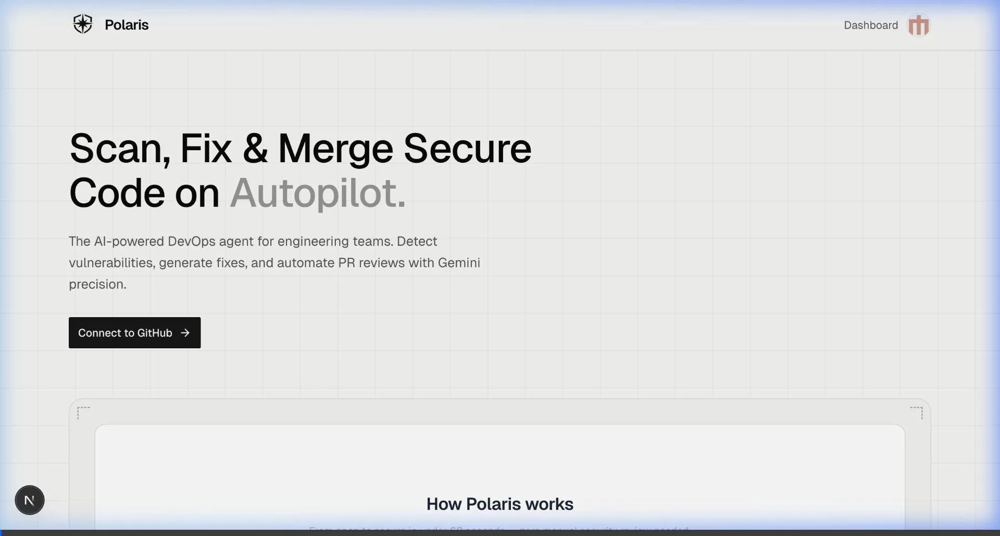
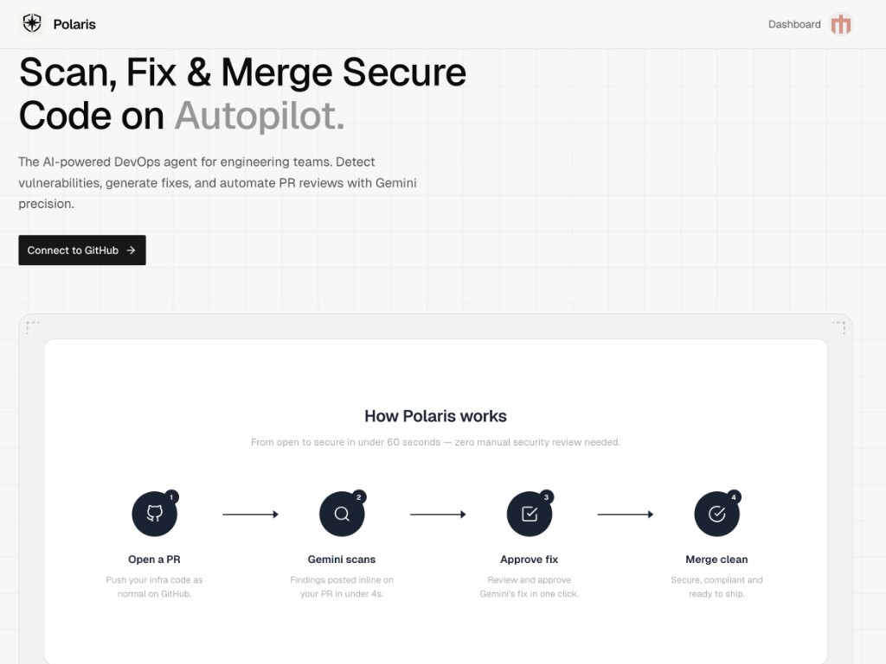
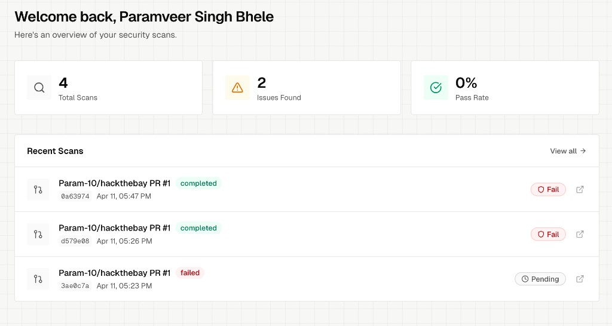
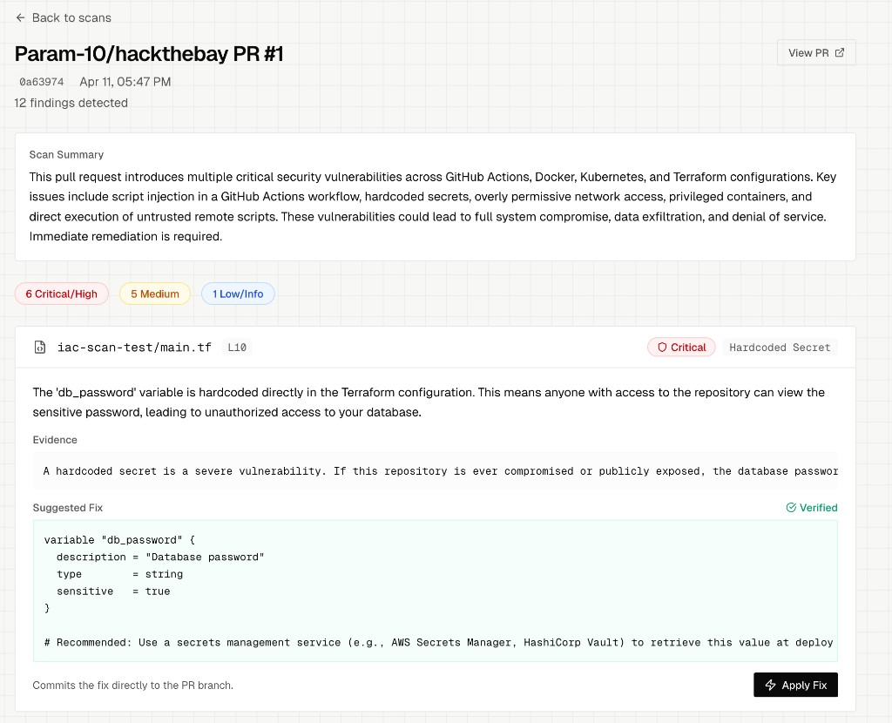

# Polaris

**AI-powered PR security review for DevOps and Infrastructure-as-Code.**

Polaris is an autonomous security agent that connects to GitHub as an App, scans every Pull Request containing infrastructure code, and posts inline findings with one-click auto-fix — all in under 60 seconds.

---

## The Problems

Infrastructure code gets reviewed for functionality but almost never for security. A developer pushes a Terraform file with an open S3 bucket, a Dockerfile with hardcoded secrets, or a Kubernetes manifest running privileged containers — it passes code review and ships to production. Nobody catches it until an audit or a breach.

Teams need a senior SRE reviewing every infrastructure change before it merges, but no team has the bandwidth for that.

## The Solution

Polaris acts like that senior SRE, automatically. Install the GitHub App, open a PR, and Polaris handles everything:

1. **Parses** the PR diff and extracts modified IaC files
2. **Scans** with deterministic rules for known anti-patterns
3. **Reasons** with Gemini to map findings to CIS/SOC2 frameworks and generate exact code fixes
4. **Reports** inline PR comments on the exact line of vulnerable code, with suggested fixes ready to commit

The entire pipeline completes in seconds with zero manual effort from the developers.

## Key Features

- **Automatic PR Scanning** — Every PR with Terraform, Kubernetes YAML, Dockerfiles, or GitHub Actions is scanned automatically via webhook
- **Gemini-Powered Analysis** — Gemini reasons about infrastructure intent, blast radius, and compliance impact
- **Inline PR Comments** — Findings posted directly on the line of code in your PR, just like a human reviewer
- **One-Click Auto-Fix** — Approve a suggested fix from the dashboard and Polaris commits it directly to your PR branch with a full audit trail
- **Security Dashboard** — Overview of all scans, findings by severity, and drill-down into individual scan results
- **Multi-User Isolation** — Each user only sees scans for their own repositories
- **Verified Patches** — A second AI agent verifies every proposed fix before presenting it

## How It Works

```
PR Opened → GitHub Webhook → FastAPI Backend → Deterministic Scan
         → Gemini (Reasoning Agent) → Gemini (Verification Agent)
         → Inline PR Comments + Commit Status → Dashboard Updated
```

1. A developer opens a PR containing infrastructure files
2. GitHub sends a webhook to the Polaris backend
3. The deterministic scanner checks for known patterns (open ports, hardcoded secrets, privileged containers, etc.)
4. Gemini analyzes each finding, maps it to compliance frameworks, and writes minimal-diff code fixes
5. A second Gemini agent reviews every patch to ensure it doesn't break existing functionality
6. Results are posted as an inline PR review on GitHub and stored in the dashboard
7. The developer can approve fixes with one click — Polaris commits directly to the PR branch

## Demo



## Screenshots

### Landing Page


### Dashboard Overview


### Scan Detail with One-Click Auto-Fix


## Tech Stack

| Layer | Technology |
|-------|-----------|
| Frontend | Next.js 15, React, Tailwind CSS |
| Auth | NextAuth.js with GitHub OAuth |
| Backend | Python, FastAPI |
| AI | Gemini 2.5 Flash / 3 Flash (configurable, dual-agent reasoning + verification) |
| Database | SQLite (local), PostgreSQL-ready |
| Webhook Proxy | Smee.io (local dev) |
| Deployment | Locally hosted (Vercel + Railway ready) |

## Running Locally

### Prerequisites

- Node.js 18+
- Python 3.11+
- A GitHub Account
- A [GitHub App](https://docs.github.com/en/apps/creating-github-apps) with PR read/write permissions and webhook configured
- A [Gemini API key](https://aistudio.google.com/apikey)

### 1. Clone the repo

```bash
git clone https://github.com/Param-10/hackthebay.git
cd hackthebay
```

### 2. Set up the frontend

```bash
npm install
```

Create `.env.local`:

```
GITHUB_ID=your_github_oauth_app_id
GITHUB_SECRET=your_github_oauth_app_secret
NEXTAUTH_SECRET=your_random_secret_string
NEXTAUTH_URL=http://localhost:3000
```

Start the frontend:

```bash
npm run dev
```

### 3. Set up the backend

```bash
cd github-app
python3 -m venv venv
source venv/bin/activate
pip install -r requirements.txt
```

Create `.env` (see `.env.example`):

```
GITHUB_APP_ID=your_app_id
GITHUB_PRIVATE_KEY=/path/to/your/private-key.pem
GITHUB_WEBHOOK_SECRET=your_webhook_secret
GEMINI_API_KEY=your_gemini_api_key
GEMINI_MODEL=gemini-2.5-flash
DATABASE_URL=sqlite:///./scans.db
```

Start the backend:

```bash
uvicorn app.main:app --reload --port 8000
```

### 4. Set up webhook forwarding

Install [smee-client](https://smee.io/) to forward GitHub webhooks to your local machine:

```bash
npm install -g smee-client
smee -u https://smee.io/YOUR_CHANNEL_ID -t http://localhost:8000/webhook
```

Set your Smee URL as the webhook URL in your GitHub App settings.

### 5. Test it

1. Install the GitHub App on a test repository
2. Open a PR with infrastructure files (`.tf`, `Dockerfile`, `k8s.yaml`, `.github/workflows/*.yml`)
3. Watch the scan results appear on the PR and in the dashboard at `http://localhost:3000/dashboard`

## Current Status

This project is **locally hosted** and was built for Hack the Bay 2026.

---
